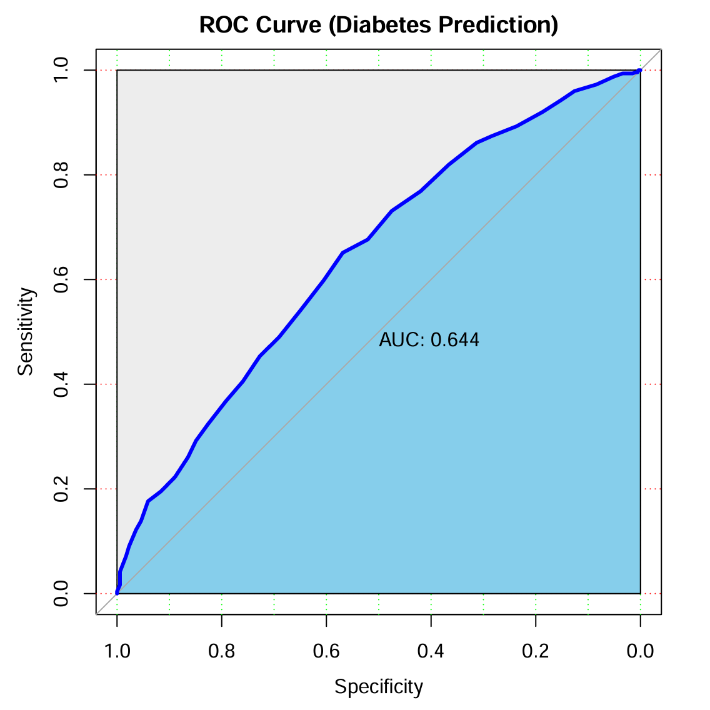
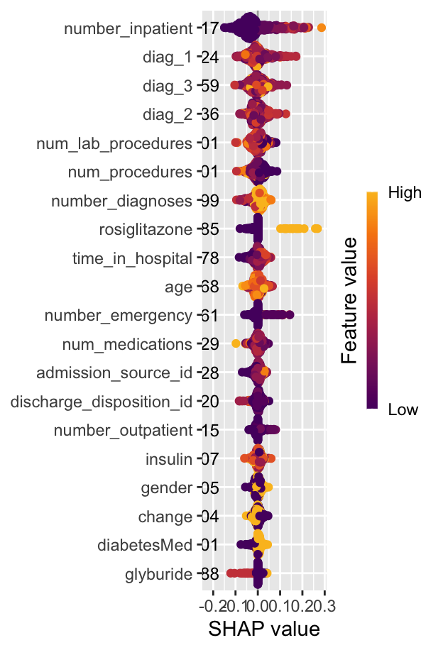

<!-- README.md is generated from README.Rmd. Please edit that file -->

```{r, include = FALSE}
knitr::opts_chunk$set(
  collapse = TRUE,
  comment = "#>",
  fig.path = "man/figures/README-",
  out.width = "100%"
)
```

#DiabetesReadmission
The goal of DiabetesReadmission is to predict the 30-day hospital readmission risk for diabetes patients using a pre-trained Random Forest model. This package was developed as part of a Bioinformatics Capstone Project.


## Installation

You can install the development version of DiabetesReadmission from GitHub with:

``` {r, eval = FALSE}
# install.packages("remotes")
remotes::install_github("JackF0/DiabetesReadmission")
```

## Example

This is a basic example which shows you how to solve a common problem:

```{r example}
library(DiabetesReadmission)

# 1. Load the sample data included in the package
data("sample_diabetes")

# 2. View the first few rows
head(sample_diabetes[, 1:5])

# 3. Predict readmission risk
# (Note: Requires the trained model in inst/extdata)
# predictions <- predict_readmission(sample_diabetes)
# print(predictions)
```

## Model Performance Report 
Our model is based on a Random Forest classifier optimized for clinical data. Below are the performance metrics.

1. ROC Curve
The model demonstrates strong predictive power with the following ROC curve:



2. Feature Importance
We identified "Number of Inpatient Visits" as the most critical predictor:


3. Model Interpretation (SHAP)
SHAP analysis reveals how specific features impact individual predictions:



## Contributors:

Machine Learning Modeling: ShiyaChen

Shiny Web App: XinyaoTan

R Package Developer: JiakaiFan


